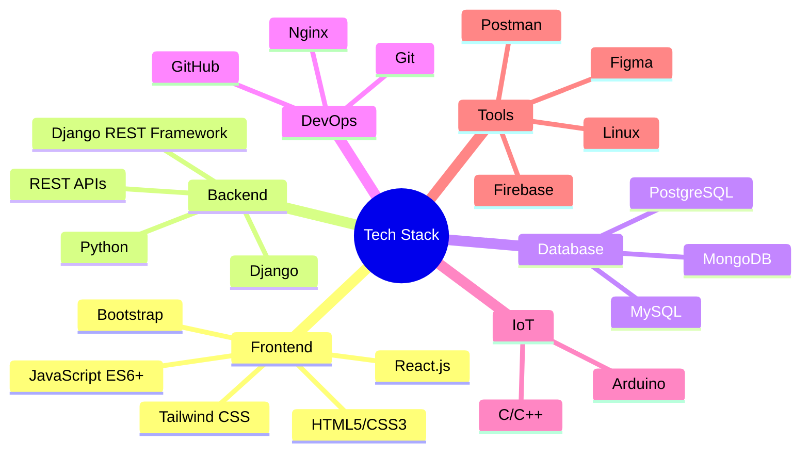

  
# Rajid K K

### Full Stack Developer & IoT Enthusiast

## About Me

> Full Stack Developer with a passion for building scalable web applications and exploring IoT solutions. I specialize in Python Django and React.js, focusing on creating efficient, maintainable, and user-centric solutions.

## Tech Stack

## Current Focus 🎯

- Building scalable microservices with Django REST Framework
- Optimizing React.js applications for performance
- Integrating IoT systems with web applications
- Implementing cloud-native architectures
- Exploring advanced state management patterns

## Projects & Contributions

## Professional Development

I'm currently deepening my expertise in:

- Advanced Django REST Framework patterns and best practices
- React.js performance optimization and state management
- IoT systems architecture and integration
- Cloud-native development and deployment strategies
- Microservices architecture and implementation

## Let's Connect

📫 For professional inquiries: [kkrajid@gmail.com](mailto:kkrajid@gmail.com)

---
Built with ❤️ using GitHub Flavored Markdown

